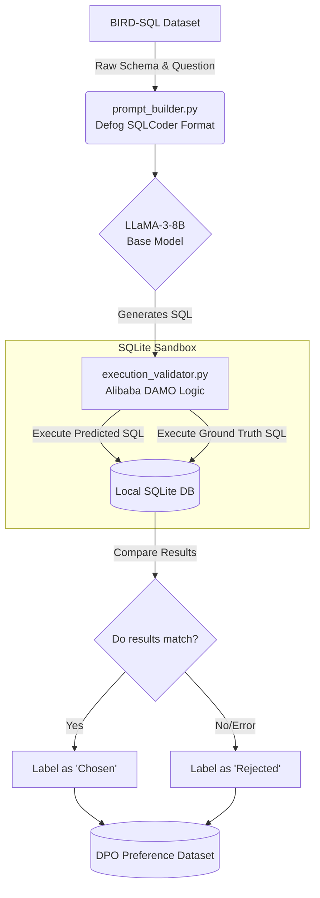
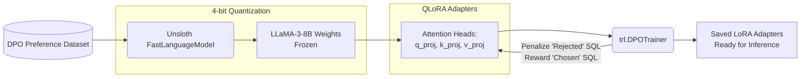

## Goal Description
Build **Bane**, a cutting-edge Execution-Aligned Text-to-SQL Agent. This document serves as the master architectural blueprint, detailing the end-to-end data flow, execution-feedback loop, and DPO training pipeline, complete with visual diagrams to explain the system structure to interviewers or reviewers.

## User Review Required
> [!IMPORTANT] Hardware Isolation
> As previously established, this architecture is designed to be executed on a Kaggle T4 x2 environment. Do not attempt to run the DPO training phase locally on the M1 Air.

## System Architecture Diagrams

### 1. The Execution-Feedback Loop (Data Generation)
This flowchart demonstrates how we build the preference dataset (Chosen vs. Rejected SQL queries) by actually running the LLM's output against a real SQLite database.



### 2. The DPO Fine-Tuning Pipeline
This flowchart illustrates the parameter-efficient fine-tuning (PEFT) process using Unsloth and Direct Preference Optimization to align the model weights.



## Proposed Changes

We will generate three core scripts inside the `Bane_Agent` workspace.

### Core Architecture Components

#### [NEW] `Bane_Agent/src/prompt_builder.py`
Extracts logic from `defog/sqlcoder` to format the context window.
```python
def format_sqlcoder_prompt(question: str, schema_metadata: str) -> str:
    """
    Constructs the prompt exactly as SQLCoder expects, injecting the schema.
    """
    prompt_template = """### Task
Generate a SQL query to answer [QUESTION]{user_question}[/QUESTION]

### Database Schema
The query will run on a database with the following schema:
{table_metadata_string}

### Answer
Given the database schema, here is the SQL query:
[SQL]"""
    return prompt_template.format(
        user_question=question, 
        table_metadata_string=schema_metadata
    )
```

#### [NEW] `Bane_Agent/src/execution_validator.py`
Extracts execution logic from `DAMO-ConvAI` to safely run SQL.
```python
import sqlite3
import traceback

def validate_sql_execution(predicted_sql: str, ground_truth_sql: str, db_path: str) -> bool:
    """
    Connects to the SQLite database and compares the execution output.
    Returns True if outputs match (Chosen), False if error/mismatch (Rejected).
    """
    try:
        conn = sqlite3.connect(db_path)
        cursor = conn.cursor()
        
        cursor.execute(predicted_sql)
        predicted_result = set(cursor.fetchall())
        
        cursor.execute(ground_truth_sql)
        truth_result = set(cursor.fetchall())
        
        conn.close()
        return predicted_result == truth_result
    except Exception as e:
        # Penalizes hallucinations (e.g., querying non-existent columns)
        return False
```

#### [NEW] `Bane_Agent/notebooks/Bane_DPO_Kaggle.ipynb`
The final pipeline using `unsloth` to train the model.
```python
# Pseudo-code structure for the Kaggle Notebook
from unsloth import FastLanguageModel
from trl import DPOTrainer
from transformers import TrainingArguments

# 1. Load the model via Unsloth for 2x faster training & 60% less VRAM
model, tokenizer = FastLanguageModel.from_pretrained(
    model_name="unsloth/llama-3-8b-Instruct",
    load_in_4bit=True
)

# 2. Attach QLoRA adapters specifically to the attention and projection heads
model = FastLanguageModel.get_peft_model(
    model, r=16, target_modules=["q_proj", "k_proj", "v_proj", "o_proj"]
)

# 3. Train using Direct Preference Optimization on our execution dataset
trainer = DPOTrainer(
    model=model,
    tokenizer=tokenizer,
    train_dataset=execution_dpo_dataset, # Contains 'prompt', 'chosen', 'rejected'
    args=TrainingArguments(
        per_device_train_batch_size=2,
        gradient_accumulation_steps=4,
        max_steps=200,
        output_dir="bane_adapters"
    )
)
trainer.train()
```

## Verification Plan
1. **Pipeline Test:** Execute `prompt_builder.py` and `execution_validator.py` locally on a sample 5-row SQLite database to ensure the loop correctly labels broken SQL as 'Rejected'.
2. **Kaggle Deployment:** Upload `Bane_DPO_Kaggle.ipynb` and verify that the 16GB T4 GPU can load the model in 4-bit without crashing.
