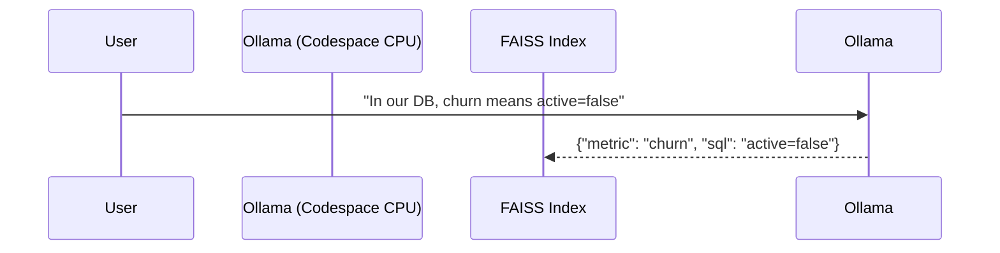
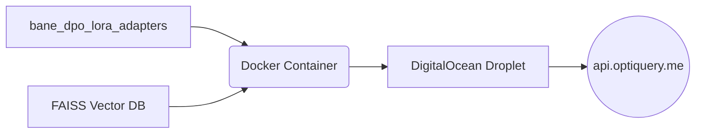

# Bane Text-to-SQL Agent: Step-by-Step Execution Plan

This document is the literal, step-by-step instruction manual to build the Bane Agent from scratch. It bridges the gap between the high-level architecture and the actual keystrokes required to build it.

---

## Phase 0: Prerequisites & Environment Setup
Before writing any code, we must provision our free resources.

1.  **Activate GitHub Student Developer Pack:** Go to GitHub Education and verify your student status to unlock free cloud credits.
2.  **Claim DigitalOcean Credits:** Within the GitHub pack, claim your $100-$200 DigitalOcean platform credits.
3.  **Claim Namecheap Domain:** Claim your free `.me` domain (e.g., `optiquery.me`).
4.  **Install Local Dependencies (Mac M1):**
    ```bash
    brew install ollama
    pip install faiss-cpu sentence-transformers typer rich fastapi uvicorn sqlite3 requests
    ```
5.  **Pull Local Model:** Pull the base LLaMA-3 model into your local Ollama instance for the Semantic Enrichment agent:
    ```bash
    ollama run llama3
    ```

---

## Phase 1: Building the Context Engine (GitHub Codespaces)
We build the tools that automatically read databases and store them in vector memory directly in the cloud browser.

### Step 1.1: The Introspector
*   **Action:** Create `src/db_introspector.py` in your Codespace.
*   **Code:** Write the Python `sqlite3` script that connects to `test.sqlite` and runs `SELECT sql FROM sqlite_master WHERE type='table'`. This grabs all `CREATE TABLE` statements.

### Step 2.2: The Vector Database
*   **Action:** Create `src/schema_rag.py`.
*   **Code:** Import `faiss` and `sentence-transformers`. Write a class that takes the output of the Introspector, embeds it using `all-MiniLM-L6-v2`, and stores it in a `faiss.IndexFlatL2`.

---

## Phase 2: The Semantic Middleman (GitHub Codespaces)
We build the agent that translates messy human rules into JSON using a lightweight CPU model.



### Step 2.1: The Enrichment Script
*   **Action:** Create `src/semantic_enrichment_agent.py`.
*   **Code:** Write a script that reads a user-provided `meta.yaml` file. Send this YAML to your local `http://localhost:11434/api/generate` (Ollama running in Codespaces) using `Llama-3.2-1B` to save RAM.
*   **Integration:** Append the resulting JSON output directly into the FAISS index built in Phase 1.

---

## Phase 3: Model Alignment & Fine-Tuning (Kaggle Cloud)
We leave the Mac and move to the cloud to train the main model.

### Step 3.1: Data Generation Sandbox
*   **Action:** Upload `src/execution_validator.py` to Kaggle.
*   **Execution:** Run a loop over 10,000 rows of the `BIRD-SQL` dataset. Ask the base LLaMA-3 model to predict the SQL. Run the prediction against the `execution_validator.py` sandbox. If it crashes, label it `Rejected`. If it matches the dataset's answer, label it `Chosen`.

### Step 3.2: DPO Training
*   **Action:** Open `notebooks/Bane_Final_Training.ipynb` on Kaggle.
*   **Execution:** 
    1. Set Accelerator to `GPU T4 x2`.
    2. Load `unsloth/llama-3-8b-Instruct` in 4-bit quantization.
    3. Feed the 10,000 `Chosen/Rejected` pairs into the HuggingFace `DPOTrainer`.
    4. Click "Save & Run All".
*   **Artifact:** Wait 10 hours. Download the resulting `bane_dpo_lora_adapters` folder back to your Mac.

---

## Phase 4: API Deployment (DigitalOcean)
We host the trained model on a live server.



### Step 4.1: The FastAPI Wrapper
*   **Action:** Create `src/api.py`.
*   **Code:** Write a FastAPI server with a `/generate_sql` POST endpoint. This endpoint loads the downloaded LoRA adapters, takes a user's question, hits the FAISS index to get the tables, and runs LLM inference to return the SQL.

### Step 4.2: Dockerization & Hosting
*   **Action:** Write a `Dockerfile` that packages `api.py`, `faiss`, `unsloth`, and the model adapters.
*   **Execution:** 
    1. Log into DigitalOcean and spin up a Basic Droplet using your student credits.
    2. SSH into the Droplet.
    3. Git clone your repo, and run `docker compose up -d`.
    4. Link your Namecheap domain (`optiquery.me`) to the Droplet's IP address.

---

## Phase 5: The Client Interface (Local Mac)
We build the `bane-cli` tool that the end-user actually interacts with on their own machine.

### Step 5.1: The Typer CLI Code
*   **Action:** Create `cli.py`.
*   **Code Implementation:** 
    *   Import `typer`, `rich.console`, and `requests`.
    *   Create `@app.command() def init(db_path: str):` which calls the `DatabaseIntrospector` from Phase 1 to automatically learn the user's database.
    *   Create `@app.command() def query(question: str):` which sends a JSON payload containing the user's question to your live DigitalOcean URL (`https://api.optiquery.me/generate_sql`).
    *   Use `rich.table.Table` to intercept the returned SQL, execute it against the local SQLite file, and print a beautiful terminal table.

### Step 5.2: Packaging the CLI (`setup.py`)
*   **Action:** Create a `setup.py` file in the root of the `Bane_Agent` directory.
*   **Execution:** Write the `setuptools` configuration to register `bane` as a global terminal command.
    ```python
    from setuptools import setup
    setup(
        name='bane-cli',
        version='1.0',
        py_modules=['cli'],
        install_requires=['typer', 'rich', 'requests'],
        entry_points='''
            [console_scripts]
            bane=cli:app
        ''',
    )
    ```

### Step 5.3: Installation & Verification
*   **Action:** Install the package on your local Mac.
*   **Execution:** Open your terminal and run `pip install -e .` (This installs the CLI in editable mode).
*   **The Final Test:** 
    1. Type `bane init test_db.sqlite`
    2. Type `bane query "Show me the top 5 highest paying customers"`
    3. Watch as your terminal instantly prints the generated SQL and the ASCII data table. The project is complete!
