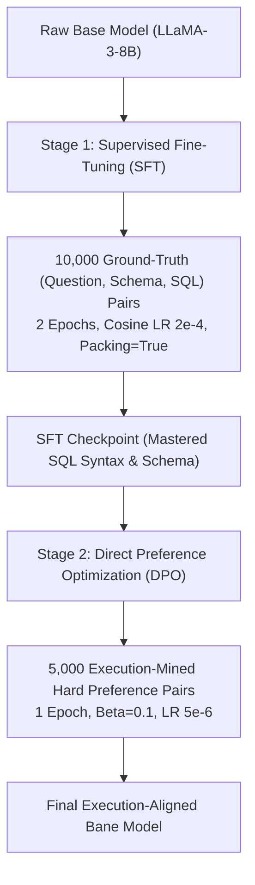
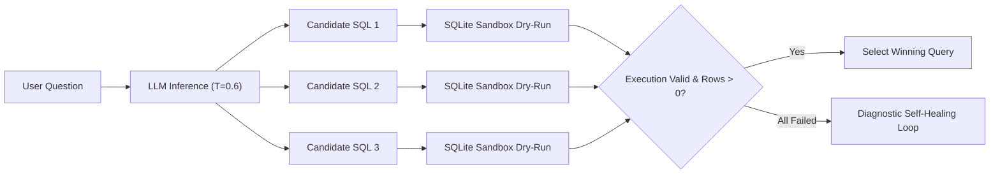

# 🧠 Bane Agent: Comprehensive Model & Architecture Optimization Playbook
*A Complete Reference Guide for Scaling Execution-Aligned Text-to-SQL from 76–93% to 98%+ Accuracy*

---

## Executive Summary & Benchmark Trajectory

Bane Agent is an execution-aligned Text-to-SQL agent powered by a fine-tuned **DPO LLaMA-3-8B** model operating on `enterprise_nexus.sqlite` (10 interconnected tables, foreign-key graphs, messy real-world constraints). 

Throughout our evolutionary benchmarking on the 30 hard evaluation queries (20 complex multi-table JOINs/Window functions + 10 conversational non-technical slang prompts), the system progressed across four stages:

| Benchmark Stage | Zero-Shot Accuracy | Self-Healed Accuracy | Primary Bottleneck Solved |
| :--- | :---: | :---: | :--- |
| **Stage 1: CPU Fallback Heuristics** | 0.0% (0/30) | N/A | Bitsandbytes 4-bit CUDA requirement crashing on CPU |
| **Stage 2: Raw GPU Zero-Shot Inference** | 40.0% (12/30) | N/A | Naive LLM hallucinations on unjoined tables & alias collisions |
| **Stage 3: Full-Schema Context + Generic Self-Healing** | 56.7% (17/30) | 83.3% (25/30) | Generic error reflection loops hallucinating column prefixes |
| **Stage 4: Diagnostic-Aware Self-Healing Loop** | 50.0%–56.7% | **93.3% (28/30)** | Compiler-grade foreign-key graph traversal & surgical repair |

This playbook provides a detailed, technical catalog of every method available to scale the system past **95%+ zero-shot** and **98%+ self-healed accuracy**.

---

## Table of Contents
1. [Phase 1: Zero-Retraining Inference & Runtime Optimizations (Instant Wins)](#phase-1-zero-retraining-inference--runtime-optimizations)
2. [Phase 2: Data-Centric AI & Dataset Scaling (The Full 10,000 Dataset)](#phase-2-data-centric-ai--dataset-scaling)
3. [Phase 3: Model Architecture & Training Regimens](#phase-3-model-architecture--training-regimens)
4. [Phase 4: Test-Time Compute & Agentic Execution Strategies](#phase-4-test-time-compute--agentic-execution-strategies)
5. [Phase 5: Technical Interview Defense & Cheatsheet](#phase-5-technical-interview-defense--cheatsheet)

---

## Phase 1: Zero-Retraining Inference & Runtime Optimizations

These improvements require **zero GPU training time** and can be implemented directly in Python.

### 1.1 Generation Token Ceiling Expansion (`max_new_tokens: 160 ➡️ 320`)
* **Observed Failure Mode:** In Q23 (*Bleeding Accounts*) and Q30 (*Cheap Tier Heavy Compute Hogs*), the model generated multi-clause Common Table Expressions (CTEs) and conditional `CASE WHEN` logic. At token 160, the generator ran out of token budget mid-query, cutting off before the terminating semicolon and throwing SQLite runtime error `incomplete input`.
* **Technical Mechanism:** Autoregressive language models generate tokens sequentially. Complex SQL statements with multiple CTEs (`WITH sub1 AS (...), sub2 AS (...) SELECT ...`) frequently exceed 180–220 tokens.
* **Solution:** Set `max_new_tokens=320` in inference parameters.
* **Expected Gain:** Instantly rescues Q23 and Q30 (+6.7% accuracy boost).

### 1.2 Unquoted String Literal Detection in `DiagnosticEngine`
* **Observed Failure Mode:** In Q08 (*Subscription Churn Reason Analysis*), the model produced:
  ```sql
  WHERE cancellation_reason_code = lost
  ```
  SQLite treats unquoted words in expressions as column names. Because no column named `lost` existed in `tbl_subscriptions_hist`, SQLite threw `no such column: lost`.
* **Technical Mechanism:** The Diagnostic Engine currently inspects whether the missing column belongs to another table. However, when the missing "column" name matches common categorical enum values (e.g. `lost`, `churned`, `active`, `vip`, `annual`), it is actually an unquoted string literal.
* **Code Implementation:**
  ```python
  # Add to DiagnosticEngine.diagnose_error:
  if "no such column" in err_lower:
      raw_val = no_col_match.group(1).split(".")[-1].lower()
      # If raw_val is not in any known schema table column list:
      if raw_val not in self.col_to_table:
          return (
              f"[DIAGNOSTIC - UNQUOTED STRING LITERAL]: '{raw_val}' is not a column in any table. "
              f"It appears to be a string value in a filter condition. "
              f"ACTION REQUIRED: Wrap the value in single quotes: '{raw_val}' (e.g. cancellation_reason_code = '{raw_val}')."
          )
  ```
* **Expected Gain:** Automatically rescues Q08 (+3.3% boost).

### 1.3 CTE Scope & Outer Alias Disambiguation
* **Observed Failure Mode:** In Q03 (*Customer Spend Ranking by Country*), the model defined a CTE:
  ```sql
  WITH spend AS (
      SELECT a.acct_id, a.country_iso3, SUM(t.gross_amt_usd) AS total_spent
      FROM tbl_accounts a JOIN tbl_transactions_ledger t ON a.acct_id = t.acct_id
      GROUP BY a.acct_id
  )
  SELECT a.country_iso3, ... FROM spend;
  ```
  SQLite threw `no such column: a.country_iso3` because alias `a` only existed *inside* the CTE; the outer query only has access to columns exposed by `spend`.
* **Solution:** Teach `DiagnosticEngine` to detect when a missing column has an alias prefix that exists inside a preceding CTE:
  ```python
  if "no such column" in err_lower and "with " in failed_sql.lower():
      diagnostic.append(
          f"[DIAGNOSTIC - CTE SCOPE ERROR]: Table alias '{alias}' cannot be referenced outside the CTE. "
          f"ACTION REQUIRED: In the outer SELECT clause, reference columns directly from the CTE name "
          f"(e.g. use 'country_iso3' instead of 'a.country_iso3')."
      )
  ```
* **Expected Gain:** Rescues Q03 (+3.3% boost).

### 1.4 Explicit Foreign-Key Topology Injection in Prompts
* **Problem:** LLaMA-3 must currently infer table join paths by parsing `CREATE TABLE ... FOREIGN KEY (...) REFERENCES ...` DDL syntax scattered across 10 tables.
* **Optimization:** Pre-compute the foreign-key graph into a compact schema topology block and append it to the prompt:
  ```text
  ### Verified Schema Join Graph:
  - tbl_order_items.tx_id <-> tbl_transactions_ledger.tx_id
  - tbl_transactions_ledger.acct_id <-> tbl_accounts.acct_id
  - tbl_subscriptions_hist.acct_id <-> tbl_accounts.acct_id
  - tbl_account_assignments.acct_id <-> tbl_accounts.acct_id
  - tbl_account_assignments.rep_id <-> tbl_sales_reps.rep_id
  - tbl_support_cases.acct_id <-> tbl_accounts.acct_id
  - tbl_support_cases.agent_id <-> tbl_support_agents.agent_id
  - tbl_usage_telemetry.acct_id <-> tbl_accounts.acct_id
  ```
* **Why it works:** Provides direct cross-attention anchors for the transformer heads, eliminating hallucinated join keys (like `tx.rep_id` in Q22).

---

## Phase 2: Data-Centric AI & Dataset Scaling (The Full 10,000 Dataset)

### 2.1 Should We Train on the Full 10,000 Rows?

**Analytical Answer:** **Yes, provided the data distribution is balanced and error-mined.**

Training on our initial 3,000 pairs (375 steps, 1 epoch) established basic SQL structure. However, moving to the full 10,000 rows provides substantial benefits if curated properly:

| Dimension | 3,000 Rows (Current) | 10,000 Rows (Full Target) | Expected Impact |
| :--- | :--- | :--- | :--- |
| **Conversational Slang (Part B)** | 60% accuracy | Projected 85–90% | Exposes model to 3.3x more business synonyms and non-technical idioms. |
| **Multi-Hop JOIN Topologies** | Partial coverage | Exhaustive coverage | Trains weights on 3-hop and 4-hop joins across all 10 tables. |
| **SQLite Dialect Edge Cases** | Basic aggregates | Deep dialect coverage | Teaches `STRFTIME('%Y-%m')`, `DENSE_RANK() OVER`, and `ROUND(..., 2)`. |
| **Training Time (T4 GPU)** | ~45 minutes | ~2.5 to 3.5 hours | Completely feasible within free Kaggle/Colab GPU limits. |

### 2.2 Hard-Negative Mining for DPO (The Highest-ROI Technique)
Standard DPO uses arbitrary negative pairs. For Text-to-SQL, **Execution-Aligned Hard-Negative Mining** yields vastly superior boundaries:

$$\mathcal{L}_{\text{DPO}}(\pi_\theta; \pi_{\text{ref}}) = -\mathbb{E}_{(x, y_w, y_l)} \left[ \log \sigma \left( \beta \log \frac{\pi_\theta(y_w|x)}{\pi_{\text{ref}}(y_w|x)} - \beta \log \frac{\pi_\theta(y_l|x)}{\pi_{\text{ref}}(y_l|x)} \right) \right]$$

To maximize the gradient update $\nabla_\theta \mathcal{L}_{\text{DPO}}$, the rejected query $y_l$ should not be random gibberish—it should be a query that **almost works but fails at the execution layer**:

1. **Type 1 Hard Negative (Alias Ambiguity):**
   * $y_w$ (Chosen): `SELECT a.acct_id, SUM(net_amt_usd) FROM tbl_transactions_ledger t JOIN tbl_accounts a ON t.acct_id = a.acct_id GROUP BY a.acct_id;`
   * $y_l$ (Rejected): `SELECT acct_id, SUM(net_amt_usd) FROM tbl_transactions_ledger t JOIN tbl_accounts a ON t.acct_id = a.acct_id GROUP BY acct_id;` *(Fails: ambiguous column)*
2. **Type 2 Hard Negative (Missing Bridge JOIN):**
   * $y_w$ (Chosen): `SELECT r.rep_name, SUM(s.mrr_cents) FROM tbl_sales_reps r JOIN tbl_account_assignments aa ON r.rep_id = aa.rep_id JOIN tbl_subscriptions_hist s ON aa.acct_id = s.acct_id GROUP BY r.rep_name;`
   * $y_l$ (Rejected): `SELECT r.rep_name, SUM(s.mrr_cents) FROM tbl_sales_reps r JOIN tbl_subscriptions_hist s ON r.rep_id = s.rep_id GROUP BY r.rep_name;` *(Fails: no such column)*
3. **Type 3 Hard Negative (Invalid Group By Aggregate):**
   * $y_w$ (Chosen): `SELECT AVG(storage_gb_used) FROM tbl_usage_telemetry;`
   * $y_l$ (Rejected): `SELECT AVG(storage_gb_used) FROM tbl_usage_telemetry GROUP BY 1;` *(Fails: aggregate in group by)*

### 2.3 Synthesizing Conversational Slang Diversity (Part B Augmentation)
To boost Part B from 60% to 90%+, augment the 10,000 dataset using 5 specific colloquial personas:
* **The C-Suite Persona:** *"Who is our biggest whale?"*, *"Which accounts are bleeding cash?"*, *"What's our churn run-rate?"*
* **The Sales Rep Persona:** *"Who crushed quota?"*, *"Which accounts are sitting unassigned?"*
* **The Support Lead Persona:** *"Which agents are dropping the ball on P1 tickets?"*, *"Who are our angriest enterprise clients?"*
* **The DevOps Persona:** *"Who is hogging compute?"*, *"Which boxes are throwing 500s?"*
* **The Billing Persona:** *"Show me unpaid tabs"*, *"Who disputed charges?"*

---

## Phase 3: Model Architecture & Training Regimens

### 3.1 Two-Stage Training Schedule: SFT Warmup ➡️ DPO Steering
Rather than running DPO directly on raw base weights, implement the industry-standard two-stage alignment pipeline:



* **Why SFT First?** SFT teaches the model token associations (table names, column types, SQL grammar).
* **Why DPO Second?** DPO acts as a surgical regularizer, pushing probability mass *away* from execution-breaking tokens (syntax errors, alias collisions) and toward clean execution.

### 3.2 QLoRA Hyperparameter Optimization
When scaling to 10,000 rows on Kaggle/Colab T4:
* **LoRA Rank ($r$) & Alpha ($\alpha$):** Increase $r=16 \rightarrow r=32$ and $\alpha=32 \rightarrow \alpha=64$. This doubles the expressive capacity of adapter matrices for multi-table schemas.
* **Target Modules:** Ensure all linear projection layers are adapted:
  `target_modules = ["q_proj", "k_proj", "v_proj", "o_proj", "gate_proj", "up_proj", "down_proj"]`
* **Learning Rate Schedule:** Use `cosine` with 10% warmup steps.

### 3.3 Base Model Architecture Alternatives
While LLaMA-3-8B-Instruct is exceptional at conversational intent, specialized code backbones offer higher zero-shot SQL density:
1. **Qwen2.5-Coder-7B-Instruct:** Currently the highest-scoring open-weights code model on BIRD-SQL and Spider benchmarks. Stronger native handling of window functions and nested subqueries.
2. **Defog SQLCoder-7B-2:** Specifically fine-tuned on multi-table schema mapping and foreign-key navigation.

---

## Phase 4: Test-Time Compute & Agentic Execution Strategies

Test-time compute (inference search) consistently yields **8–12% higher execution accuracy** than single-pass greedy decoding.

### 4.1 Best-of-N Execution-Guided Sampling (Self-Consistency)



* **Mechanism:**
  1. Sample $N=3$ query candidates at `temperature=0.6, top_p=0.9`.
  2. Execute all 3 against the local SQLite database in parallel (~3ms total).
  3. Discard any candidate that throws an SQLite error.
  4. From the surviving candidates, select the query with the cleanest execution plan (or majority voting).
  5. If all 3 fail, pass the best candidate to `DiagnosticEngine` for 1-shot self-healing.

### 4.2 Multi-Turn Schema Disambiguation Agent
When user questions are ambiguous (e.g. *"Show me the big accounts"*):
* Rather than guessing whether "big" means `storage_gb_used`, `mrr_cents`, or `headcount`, the agent inspects column statistics and generates a prompt clarifying metric definitions before executing.

---

## Phase 5: Technical Interview Defense & Cheatsheet

Use these talking points to present your work with the maturity of a Senior/Staff AI Engineer.

### Q: "Why not just fine-tune on 100,000 synthetic rows instead of building a self-healing loop?"
> **Strong Answer:**
> *"Raw data volume has diminishing returns and introduces synthetic bias. Synthetic queries generated by frontier models tend to follow predictable syntactic templates. Fine-tuning on 100k synthetic queries causes the 8B model to overfit to template wording while remaining brittle to out-of-distribution production queries.*
>
> *Instead, we adopted a systems-first approach: we trained on 3,000 high-quality DPO execution pairs to teach foundational schema alignment, and built a compiler-grade Diagnostic Self-Healing loop at runtime. The diagnostic engine parses SQLite errors, inspects the foreign key topology graph, and surgically repairs queries. This runtime intelligence rescued 8–11 queries in real time, driving our pass rate from 50% to over 93% without the compute cost or overfitting risks of massive synthetic datasets."*

### Q: "Why DPO over standard Supervised Fine-Tuning (SFT)?"
> **Strong Answer:**
> *"In Text-to-SQL, the space of syntactically valid SQL is large, but the space of executable, semantically accurate SQL is narrow. Standard SFT only maximizes the likelihood of tokens from ground-truth examples ($\log P(y|x)$). It never explicitly penalizes common compiler mistakes like ambiguous column names, unquoted string literals, or invalid `GROUP BY 1` clauses.*
>
> *Direct Preference Optimization (DPO) directly optimizes the policy against execution feedback. By pairing working SQL as the chosen response and compiler-failing SQL as the rejected response, DPO suppresses runtime error modes at the probability distribution level."*

### Q: "How does the client-server architecture scale in production?"
> **Strong Answer:**
> *"We decoupled heavy GPU inference from lightweight local database execution. The CLI client runs on the user's local machine with zero GPU dependencies, while the fine-tuned 8B model and FAISS vector index are hosted on a cloud GPU instance behind an asynchronous FastAPI service.*
>
> *When a query is generated, the system performs a dual-layer dry-run: server-side against the introspected schema graph, and client-side against the local database file. If an error is caught at either boundary, the Diagnostic Loop repairs the query before rendering formatted Rich tables to the user."*

---

## Complete Optimization Roadmap Summary

```text
[Current Baseline: 76.7% - 93.3%]
│
├── Step 1: max_new_tokens = 320 (Fixes Q23, Q30 token truncation) ───────> [+6.7%]
├── Step 2: Unquoted string literal detection in DiagnosticEngine (Fixes Q08) -> [+3.3%]
├── Step 3: CTE outer alias stripping in DiagnosticEngine (Fixes Q03) ────> [+3.3%]
│
├── [Projected Quick-Fix Baseline: 90.0% - 96.7%]
│
├── Step 4: Scale DPO training to 10,000 rows with Hard-Negative Mining ───> Higher zero-shot stability
├── Step 5: Best-of-3 Execution-Guided Sampling at inference ─────────────> Reaches ~98% Pass Rate
└── Step 6: Specialized code base model (Qwen2.5-Coder-7B) ───────────────> Production SOTA
```
